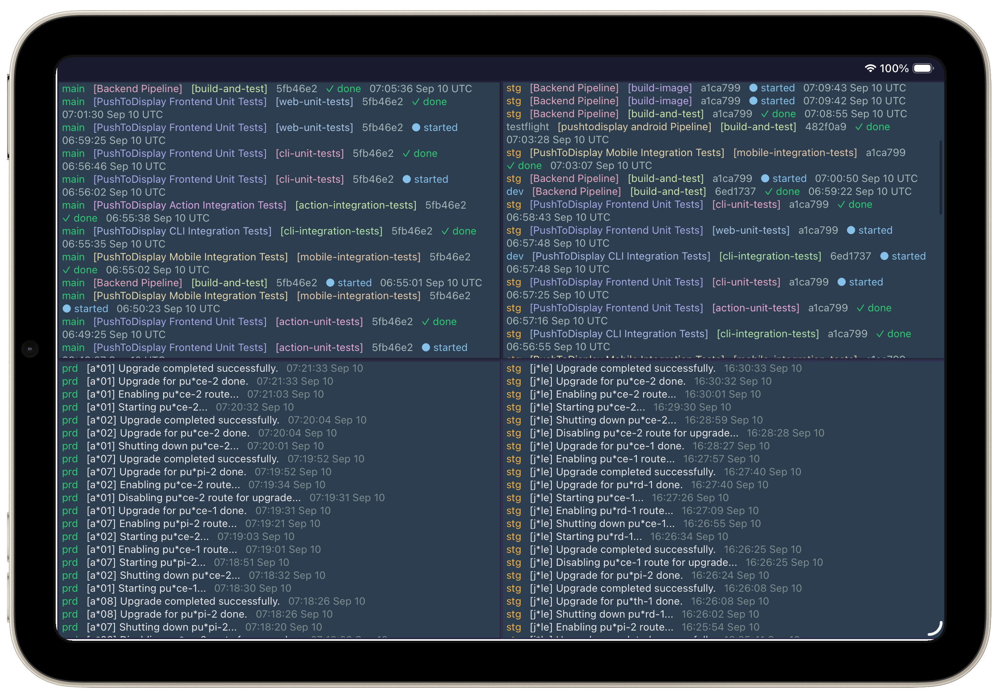
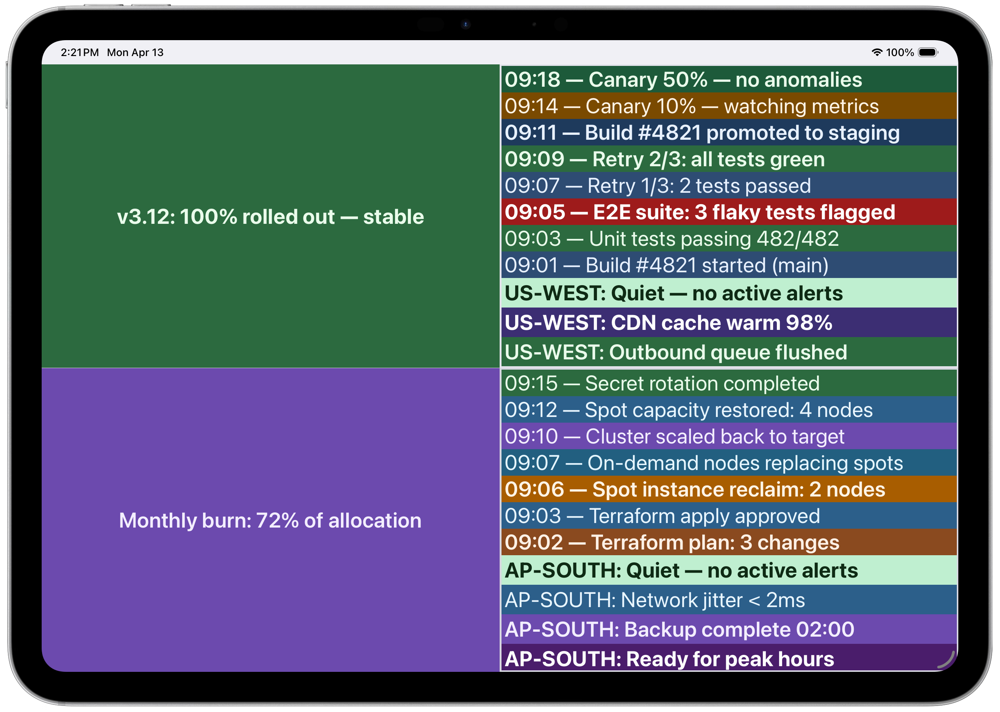
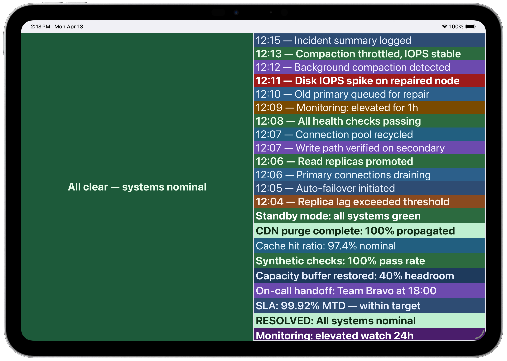

# Push to Display — GitHub Action

A GitHub Action that pushes content to devices using the [Push to Display](https://pushtodisplay.com) API. Use it in your CI/CD workflows to send deployment statuses, build results, alerts, or any structured content to physical display devices.

<p align="center">
  
</p>

## Quick Start

```yaml
- uses: pushtodisplay/action@v1
  with:
    api-key: ${{ secrets.PTD_API_KEY }}
    board-id: ${{ secrets.PTD_BOARD_ID }}
    text: "Deploy completed ✓"
```

## Inputs

| Input        | Required | Description                                                                       |
| ------------ | -------- | --------------------------------------------------------------------------------- |
| `api-url`    | No       | Base URL of the Push to Display API (default: `https://api.pushtodisplay.com`)    |
| `api-key`    | **Yes**  | API key for authentication (`X-Api-Key` header)                                   |
| `board-id`   | No       | Signed board ID to push content to. If omitted, the user's default board is used. |
| `text`       | No\*     | Simple text content to display (creates a single block)                           |
| `size`       | No       | Text size: `small`, `medium`, or `large` (applies to `text` only)                 |
| `weight`     | No       | Text weight: `regular`, `semibold`, or `bold` (applies to `text` only)            |
| `color`      | No       | Text color in hex format `#RRGGBB` (applies to `text` only)                       |
| `blocks`     | No\*     | JSON array of display blocks (see below)                                          |
| `panel-id`   | No       | Panel ID (1–4) to target a specific panel                                         |
| `full-panel` | No       | Use full panel display mode (`true`/`false`, default `false`)                     |
| `density`    | No       | Line density: `compact`, `standard`, or `spacious`                                |
| `align-x`    | No       | Horizontal alignment: `start`, `center`, or `end`                                 |
| `align-y`    | No       | Vertical alignment: `start`, `center`, or `end`                                   |
| `background` | No       | Background color in hex format (`#RRGGBB`)                                        |

\* Either `text` or `blocks` must be provided. If both are given, `blocks` takes precedence.

## Outputs

| Output       | Description                        |
| ------------ | ---------------------------------- |
| `message-id` | The message ID returned by the API |

## Failure behavior

This action **never fails the workflow**. All errors — misconfigured inputs,
invalid credentials, a missing board, or a Push to Display API outage — are
reported as **warning annotations** on the step, and the step always succeeds.
Requests are time-boxed (30s) so a hung connection cannot stall a workflow.

If your board is not updating, check the warning annotations on the run:

- `Push to Display API returned 404...` — check `board-id` / `api-key`
- `Push to Display API returned 401/403...` — invalid or revoked API key
- `Push to Display API returned 5xx...` — temporary service issue
- `Push to Display: ...` (no API message) — misconfigured input

To report at the end of a job even when earlier steps fail, use `if: always()`:

```yaml
- name: Report status
  if: always()
  uses: pushtodisplay/action@v1
  with:
    api-key: ${{ secrets.PTD_API_KEY }}
    board-id: ${{ secrets.PTD_BOARD_ID }}
    text: "Run ${{ github.run_number }} finished"
```

## Examples

### Simple text message

```yaml
- uses: pushtodisplay/action@v1
  with:
    api-key: ${{ secrets.PTD_API_KEY }}
    board-id: ${{ secrets.PTD_BOARD_ID }}
    text: "Build #${{ github.run_number }} passed"
```

### Styled text message

```yaml
- uses: pushtodisplay/action@v1
  with:
    api-key: ${{ secrets.PTD_API_KEY }}
    board-id: ${{ secrets.PTD_BOARD_ID }}
    text: "Deploy OK"
    size: "large"
    weight: "bold"
    color: "#00FF00"
    background: "#0F172A"
```

### Styled blocks

```yaml
- uses: pushtodisplay/action@v1
  with:
    api-key: ${{ secrets.PTD_API_KEY }}
    board-id: ${{ secrets.PTD_BOARD_ID }}
    blocks: |
      [
        { "text": "Deploy completed", "size": "large", "weight": "bold", "color": "#E8FFF6" },
        { "text": "Environment: production", "color": "#94A3B8" },
        { "text": "Commit: ${{ github.sha }}", "size": "small" }
      ]
    background: "#0F172A"
    density: "standard"
    align-x: "center"
    align-y: "center"
```

### Target a specific panel

```yaml
- uses: pushtodisplay/action@v1
  with:
    api-key: ${{ secrets.PTD_API_KEY }}
    board-id: ${{ secrets.PTD_BOARD_ID }}
    text: "Queue: 12 | Errors: 0"
    panel-id: "2"
```

### Use outputs in subsequent steps

```yaml
- uses: pushtodisplay/action@v1
  id: push
  with:
    api-key: ${{ secrets.PTD_API_KEY }}
    board-id: ${{ secrets.PTD_BOARD_ID }}
    text: "Deployment started"

- run: echo "Message ID is ${{ steps.push.outputs.message-id }}"
```

## Block Format

Each block in the `blocks` array supports these fields:

| Field        | Required | Description                        |
| ------------ | -------- | ---------------------------------- |
| `text`       | **Yes**  | The text content to display        |
| `size`       | No       | `small`, `medium`, or `large`      |
| `weight`     | No       | `regular`, `semibold`, or `bold`   |
| `color`      | No       | Text color (`#RRGGBB`)             |
| `background` | No       | Block background color (`#RRGGBB`) |

## Authentication

This action uses API keys for authentication. API keys are issued from the Push to Display admin portal and should be stored as [GitHub secrets](https://docs.github.com/en/actions/security-for-github-actions/security-guides/using-secrets-in-github-actions).

1. Open the Push to Display admin portal
2. Navigate to **API Keys** and tap **Issue API Key**
3. Copy the API key and add it as a repository secret (e.g., `PTD_API_KEY`)

## Screenshots

<p align="center">
  <br />
  <em>4-panel layout — multi-repo CI/CD status and deployment logs at a glance</em>
</p>

<p align="center">
  <br />
  <em>Multi-panel with CI/CD pipeline and infrastructure logs</em>
</p>

<p align="center">
  <br />
  <em>Incident timeline with color-coded severity</em>
</p>

## Development

```bash
# Install dependencies
npm install

# Run tests
npm test

# Type check
npm run typecheck

# Build the action
npm run build
```
